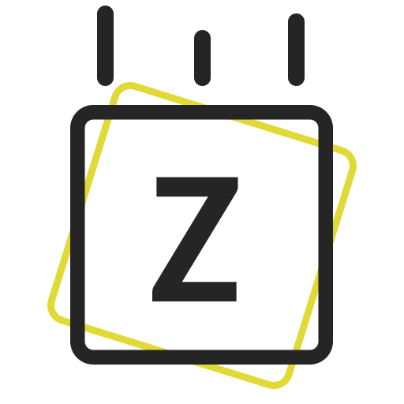



<!-- PROJECT SHIELDS -->
<!--
*** I'm using markdown "reference style" links for readability.
*** Reference links are enclosed in brackets [ ] instead of parentheses ( ).
*** See the bottom of this document for the declaration of the reference variables
*** for contributors-url, forks-url, etc. This is an optional, concise syntax you may use.
*** https://www.markdownguide.org/basic-syntax/#reference-style-links
-->
[![Issues][issues-shield]][issues-url]

<!-- PROJECT LOGO -->
 

  

  <h3 align="center">Z-Intro Library</h3>

  

    HTML Library for Intro and Transition
     
    <a href="https://zoksss.github.io/z-intro-lib/">View Demo</a>
  

<!-- ABOUT THE PROJECT -->
## About The Project

### Built With

* [CSS](#)
* [JS](#)

<!-- USAGE EXAMPLES -->
## Usage

If you are a cuber, most of the stuff will be self explanetory, but I still made a how to use guide, which is on website, on this link: 

https://friend-cube.herokuapp.com/help.html

*Note: Help only works on larger screens.

<!-- MARKDOWN LINKS & IMAGES -->
<!-- https://www.markdownguide.org/basic-syntax/#reference-style-links -->
[stars-shield]: https://img.shields.io/github/stars/othneildrew/Best-README-Template.svg?style=for-the-badge
[stars-url]: https://github.com/Zoksss/friend-cube/stargazers
[issues-shield]: https://img.shields.io/github/issues/othneildrew/Best-README-Template.svg?style=for-the-badge
[issues-url]: https://github.com/Zoksss/friend-cube/issues
[license-shield]: https://img.shields.io/github/license/othneildrew/Best-README-Template.svg?style=for-the-badge
[license-url]: https://github.com/othneildrew/Best-README-Template/blob/master/LICENSE.txt
[linkedin-shield]: https://img.shields.io/badge/-LinkedIn-black.svg?style=for-the-badge&logo=linkedin&colorB=555
[product-screenshot]: /public/assets/readme-project-ss.png